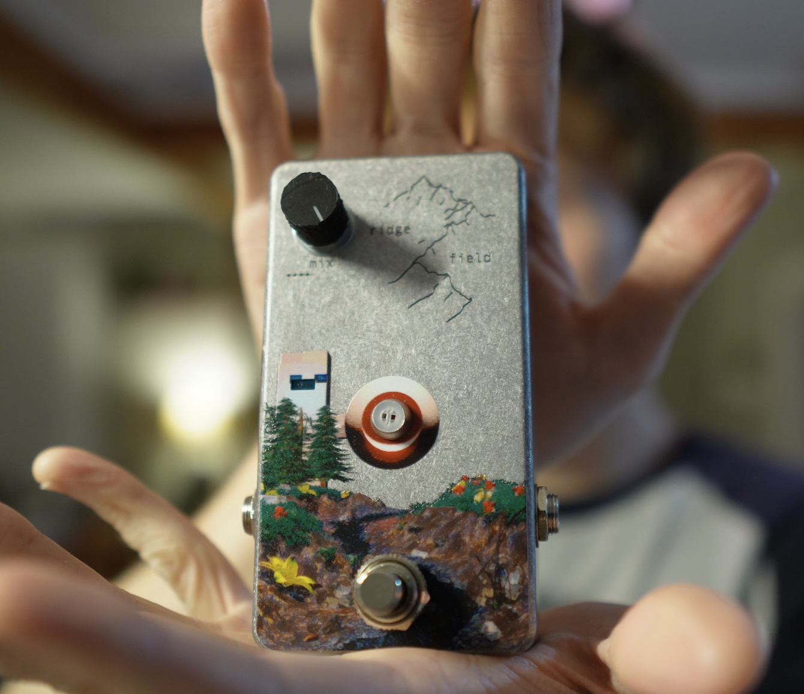
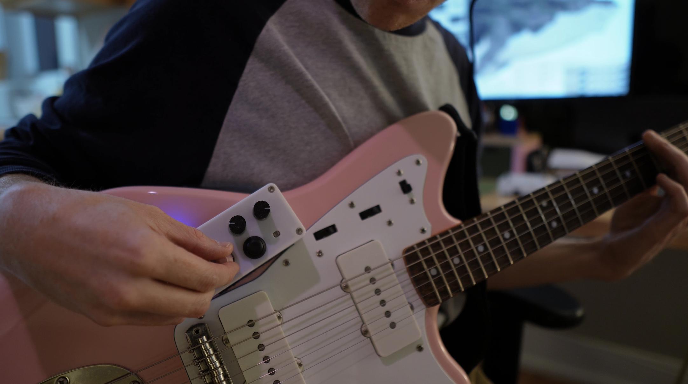
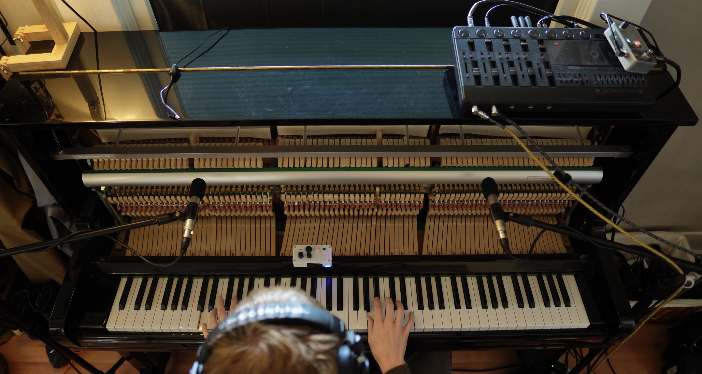
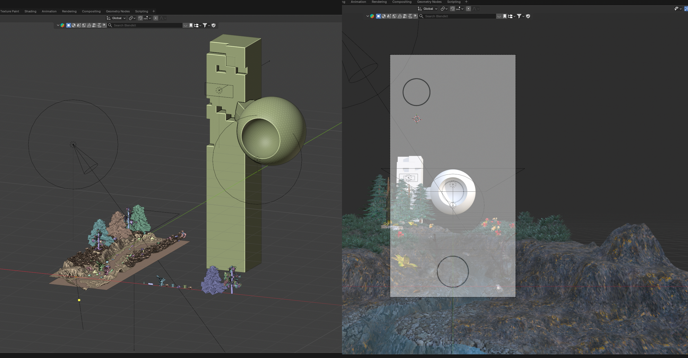

# Ridge Field

Fully wireless guitar pedal. A small box mounts on the guitar and sends its knobs, joystick and light sensor over Bluetooth to the pedal on the floor, which runs everything and does processing through a Daisy Seed.

**[Full video walking through the pedal!](LINK_HERE)**



Everything here is free to use!! Please let me know if you make anything with something here, I'd really love to see :)

## Contents

- [`hardware/`](hardware/): KiCad projects for both boards, custom libraries, and ready-to-order PCBWay files
- [`firmware/`](firmware/): all the code
  - [`firmware/daisy/`](firmware/daisy/): the audio DSP running on the Daisy Seed in the pedal
  - [`firmware/ESP32C3/`](firmware/ESP32C3/): the Bluetooth link (guitar-side server and pedal-side client)
- [`enclosure/`](enclosure/): FreeCAD models, STLs, and the Tayda drill template

## How it works

There are two units:

- **Server (on the guitar):** a XIAO ESP32-C3 reads the two knobs, an LDR (light sensor) and a joystick, then sends any changes over BLE. It runs off a Li-ion battery.
- **Main/Client (the pedal):** a second XIAO ESP32-C3 connects to the server and passes the control values to a Daisy Seed over UART. Then the Daisy does all the audio processing.



## Controls

| Control            | What it does                                                             |
| ------------------ | ------------------------------------------------------------------------ |
| Knob 1             | Delay time                                                               |
| Knob 2             | Delay feedback (fully down turns the delay off)                          |
| LDR                | Reverb. Cover it with your hand for more                                 |
| Joystick X         | Pitch shift, an octave up or down depending on direction                 |
| Joystick Y         | Bitcrusher. One direction lowers bit depth, the other lowers sample rate |
| Button press       | Latch the current joystick position                                      |
| Button hold        | LDR calibration, see below                                               |
| Mix knob (pedal)   | Dry/wet                                                                  |
| Footswitch (pedal) | Bypass                                                                   |

**LDR calibration:** hold the joystick button. For the first few seconds leave the LDR uncovered. Once the LED starts blinking fast, cover it and keep holding until the LED goes back to normal (~7 s total). The pedal saves the calibration so it survives next time you unplug and replug.



## Building one

Rough order:

1. **PCBs:** order the 2 pcbs located in [`hardware/PCBWayFiles`](hardware/PCBWayFiles/) (Gerbers, BOM and pick-and-place are all there).
2. **Server Enclosure:** 3D print the parts in [`enclosure/STL files`](enclosure/STL%20files/). Uses [M3x6mm screws](https://www.amazon.com/dp/B0DJQG5YLF?ref_=ppx_hzsearch_conn_dt_b_fed_asin_title_2) and [M3 heat inserts](https://www.amazon.com/dp/B08BCRZZS3).
3. **Main Enclosure:** the main enclosure is a 1590B pedal. I used [Tayda Electronics](https://www.taydaelectronics.com/1590b-style-aluminum-diecast-enclosure.html) for mine so I could order it fully drilled and with a UV print. Here's the [Tayda drill template](enclosure/Tayda_Drill_Schematic.txt).
4. **Firmware:** flash both ESP32-C3s from [`firmware/ESP32C3`](firmware/ESP32C3/), then build and flash the Daisy from [`firmware/daisy`](firmware/daisy/).

See each folder's README for more details.

## The artwork

I got the art on the enclosure UV printed through Tayda. The art isn't included in this repo, but here's how I did it in Blender!



You can attach an image as a background to a camera in Blender. So I took the drill schematic coords and made an illustrator file showing the holes that I added as the background. Then I could easily place objects in the scene and it would line up later with the pedal (for some reason the bluetooth LED on the left didn't line up perfectly, so I think I must've gotten the coords off a tiny bit).

I have a video [here](https://www.youtube.com/watch?v=Ckmy4d0Q_N0&t=555s) showing how to make designs for Tayda's UV printing service.

## Clone it

The DSP library I used is a git submodule, so clone with:

```sh
git clone --recursive https://github.com/skngh/RidgeField.git
# if you already cloned it:
git submodule update --init
```

## Caveats

As I mentioned in the video, I am actually planning on making a V2 of the main pedal PCB going forward. It is fully functioning, but you can hear some of the data transfers as these consistent beeps going, and I'm an idiot who didn't add a LPF to the output buffer, so there's lots of high frequency noise. It's far above the range of human hearing, but I had this issue in the past where some annoying looper pedal folded that range down and caused all this aliasing (at least I think that's what happened), so I plan on making the board 4 layers and then adding a LPF across the output buffer's op amp. Relatively easy, but in order to test I'd have to reorder the boards and I don't really wanna spend that money right now :o

## Built with

- [Daisy Seed](https://electro-smith.com/products/daisy-seed) + [libDaisy](https://github.com/electro-smith/libDaisy) / [DaisySP](https://github.com/electro-smith/DaisySP)
- [Seeed XIAO ESP32-C3](https://wiki.seeedstudio.com/XIAO_ESP32C3_Getting_Started/)
- [NimBLE-Arduino](https://github.com/h2zero/NimBLE-Arduino)
- My [Simple-DSP](https://github.com/skngh/Simple-DSP) library
- KiCad 10.0, FreeCAD 1.1, Blender

## License

[MIT](LICENSE). Do whatever you want with it!
